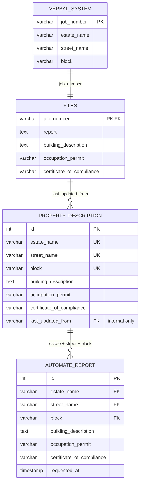

# Property Lookup DB

Combines O Drive (Verbal System) and J Drive (Files) into a property lookup.
Schema source: [`plan.dbml`](plan.dbml)

```mermaid
erDiagram
  VERBAL_SYSTEM ||--|| FILES : "job_number"
  FILES ||--o{ PROPERTY_DESCRIPTION : "last_updated_from"
  PROPERTY_DESCRIPTION ||--o{ AUTOMATE_REPORT : "estate + street + block"

  VERBAL_SYSTEM {
    varchar job_number PK
    varchar estate_name
    varchar street_name
    varchar block
  }

  FILES {
    varchar job_number PK, FK
    text report
    text building_description
    varchar occupation_permit
    varchar certificate_of_compliance
  }

  PROPERTY_DESCRIPTION {
    int id PK
    varchar estate_name UK
    varchar street_name UK
    varchar block UK
    text building_description
    varchar occupation_permit
    varchar certificate_of_compliance
    varchar last_updated_from FK "internal only"
  }

  AUTOMATE_REPORT {
    int id PK
    varchar estate_name FK
    varchar street_name FK
    varchar block FK
    text building_description
    varchar occupation_permit
    varchar certificate_of_compliance
    timestamp requested_at
  }
```
